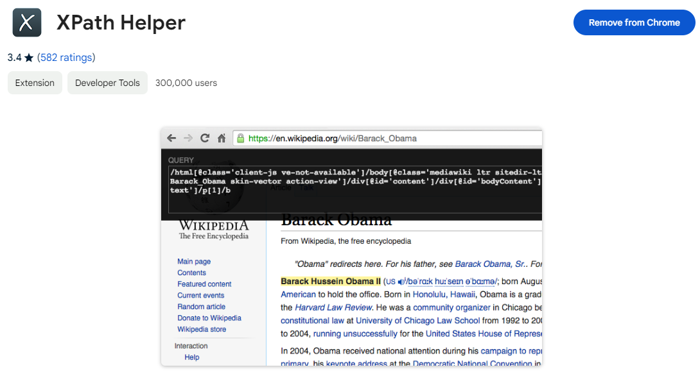

# Esjzone 网络请求
我会在这里详细介绍一下如何请求 Esjzone 的数据，Esjzone 的网站是半前后端分离的，一部分内容前后端分离了，一部分没有，所以我不得不使用 Jsoup 和 Xsoup 来进行数据解析，不过解析数据不是什么难事，先得搞清楚怎么获取到这些页面才行。

## 如何通过 XPath 进行数据检索
！！ Xsoup 对 XPath 的部分函数并不支持，但是这是我用起来最舒服简洁的库，你也可以考虑使用其他库

为了方便开发，你首先应该在你的浏览器上安装 XPath Helper 插件：https://chromewebstore.google.com/detail/xpath-helper/hgimnogjllphhhkhlmebbmlgjoejdpjl



然后我们打开网站后，按下 Ctrl + Shift + X 即可打开 XPath Helper，然后按住 Shift 后移动鼠标，便会显示鼠标所在控件的 XPath 了，可以看到部分空间后面有 \[1] 这样的字样，这是因为其父元素包含多个同类型的元素，我为了避免 css 类名导致无法正常检索所以把类名特定都删去了，如果你害怕无法准确检索控件，可以考虑保留 css style 的类名。


然后参考 Xsoup 的 README 就可以轻松的处理数据了：https://github.com/code4craft/xsoup

## Esjzone 网络功能

### 登录
#### 第一步
先向 `https://www.esjzone.me/my/login` 发送一个 POST 请求，并在 Payload 里添加以下参数：
```json
{
  "plxf": "getAuthToken"
}
```
随后会返回一个html标签 `<JinJing>{authorization_token}</JinJing>`，其中的 {authorization_token} 需要被提取保存，你可以直接用 substring 去头去尾。

#### 第二步
向 `https://www.esjzone.me/inc/mem_login.php` 发送一个 POST 请求，并在 Header 中添加 `Authorization: {authorization_token}` 这个 {authorization_token} 就是上方要求你保存下来的数据。 \
同时还需要添加以下 Payload：
```json
{ 
  "email": "{email}",
  "pwd": "{password}",
  "remember_me": "on"
}
```
{email} 为你登录账号的电子邮箱，{password} 为你登录账号的密码，不建议修改 remember_me 的内容，因为不确定如果不开启记住我是否会正常生成需要的数据。

之后会返回一个 json 内容，你可以通过判断里面的 `status` 是否为一个 200 的 Int 值来判断是否登陆成功。登录成功后会给你设置 Cookie，你要将其中的 `ews_key` 和 `ews_token` 保存下来。

#### 第三步
做任何需要账号登录的请求时，在 Cookie 中添加刚出储存的 `ews_key` 和 `ews_token`

### 登出
直接向 `https://www.esjzone.me/my/logout` 发送 GET 请求即可，需带有 Cookie `ews_key` 和 `ews_token`

请求后 `ews_key` 和 `ews_token` 会过期，无法正常使用。

### 论坛获取分页内容
我们通过 `https://www.esjzone.me/forum/1584622325/1626490073/` 这个论坛页面进行演示

#### 第一步
先向 `https://www.esjzone.me/forum/1584622325/1626490073/` 发送一个 POST 请求，需要登录验证的 Cookie，并带有以下 Payload：
```json
{
  "plxf": "getAuthToken"
}
```
然后会像登录过程的第一步一样返回标签，我们需要提取其中的 token

#### 第二步
向 `https://www.esjzone.me/inc/forum_list_data.php?totalRows=277&sort=last_reply&order=desc&offset=40&limit=20` 发送数据请求，你需要修改这个链接的部分数据，totalRows 先不填，因为你不知道这个，offset 就是偏移量，limit 是返回的数据大小，在这个例子中，limit 为 20，offset 为 40，所以意思就是返回第三页的内容。 \
你应该注意到了，这个链接中并没有参数指明我要在哪个论坛里获取，这是因为它是通过你在第一步生成的 token 来进行判断的，而且这个 token 过期很快，所以这两步必须连起来快速完成。

返回的数据的格式类似以下：
```json
{
	"status": 200,
	"total": 0,
	"rows": [
		{
			"subject": "<a href=\"/forum/1626490073/203521.html\" target=\"_blank\">第一步</a>", // 这是标题
			"cdate": "龍女控<div class=\"forum-desc\">2024-03-19</div>", // 这是创建日期和创建者
			"vtimes": "0<div class=\"forum-desc\">15</div>", // 这是评论的数量和观看的数量
			"last_reply": "" // 最后一次评论的时间
		},
		...
	]
}
```
可以看到它返回的数据里直接夹杂着 html 标签，但这个还算好处理的，因为格式很明确，但是小说的简介的 html 十分的杂乱，分析起来很困难，还需各位帮助提交一点 pr 了！

### 收藏
#### 第一步
向整合页请求获取到 auth token
#### 第二步
发送 POST 请求到 https://www.esjzone.me/inc/mem_favorite.php \
它会切换这个小说的收藏状态，所以你需要通过 xpath 获取到收藏那个按钮上的文字是“已收藏”还是“收藏”来判断你是否收藏了该小说

它会返回一个 Json
```json
{
  "status": 200,
  "msg": "",
  "url": "",
  "id": "",
  "swal": "",
  "favorite": 1438 // 这个位置是更新收藏状态后新的收藏数，到时候需要在点了收藏按钮后更新收藏数
}
```

### 移除观看记录
#### 第一步
向 `https://www.esjzone.me/my/view` 请求获取到 auth token
#### 第二步
向 `https://www.esjzone.me/inc/mem_view_del.php` 发送 POST 请求 \
Payload:
```json
{
  "vid": 历史记录id（不理解为什么要给历史记录专门定义一个id）
}
```
