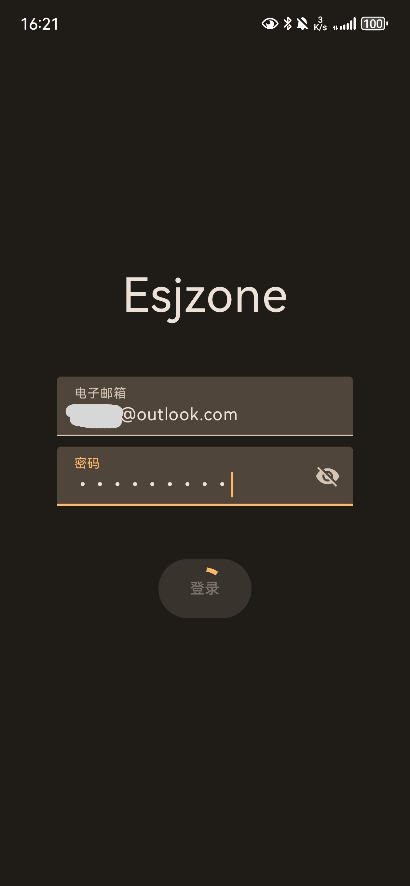
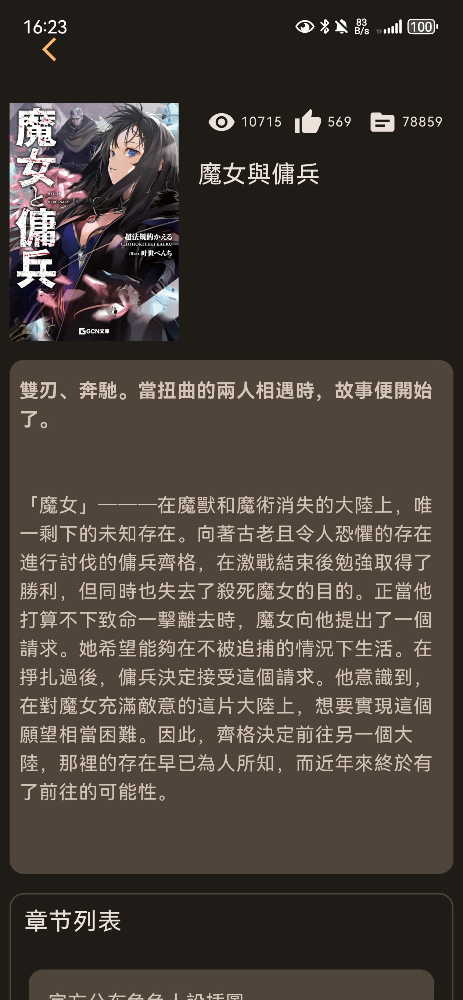
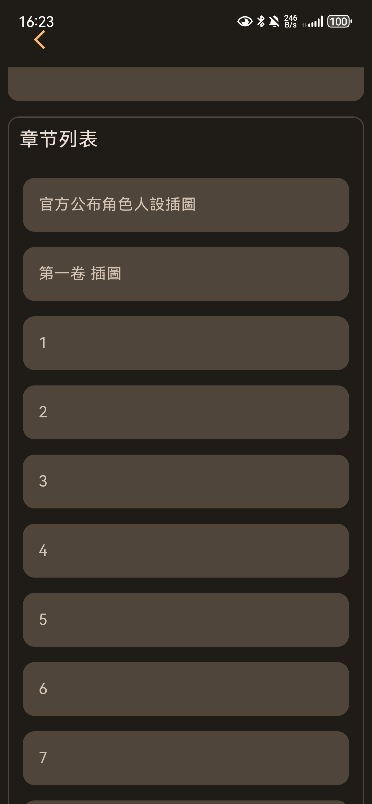
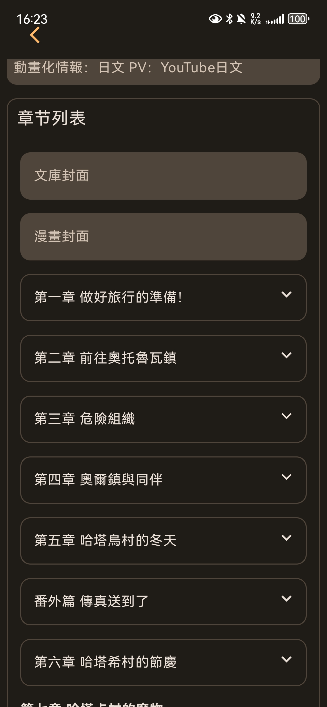
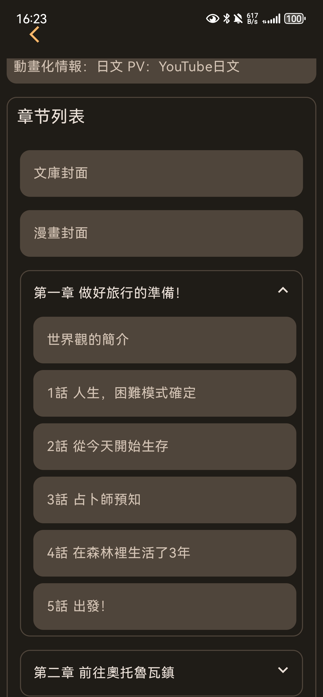
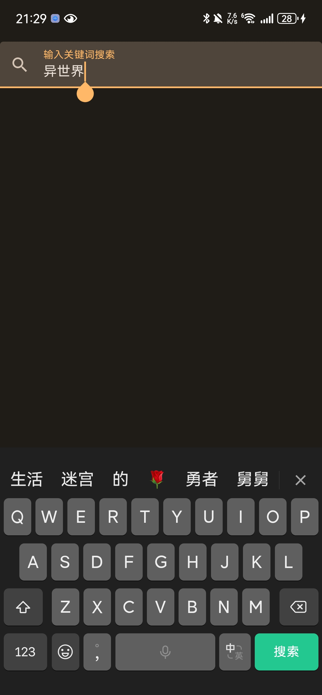
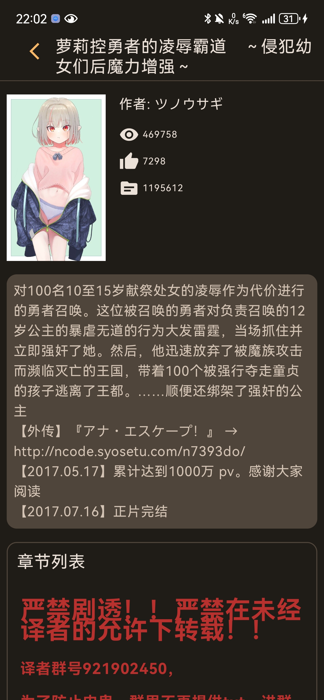
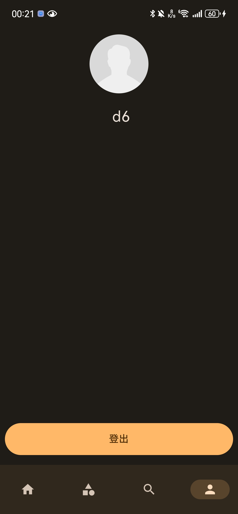
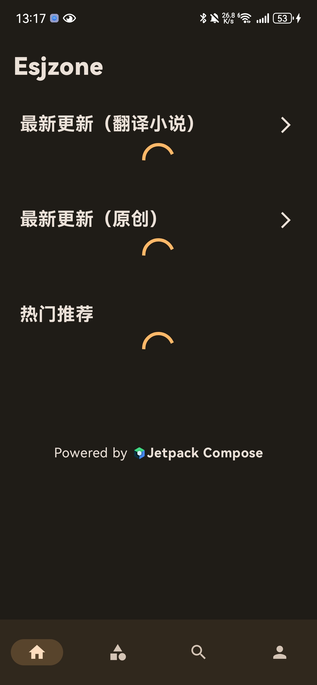
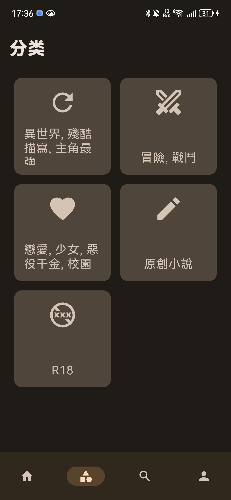

# Esjzone

一个为安卓平台打造的 Esjzone 应用，基于 Jetpack Compose

查看 [NETWORK.md](./NETWORK.md) 来了解 Esjzone 网络请求相关内容

目前开发进度：首页的小说都能打开详细页并打开章节页面进行阅读了，~~接下来把搜索做出来就可以暂缓开发进度了。~~ \
搜索完成后会先完成收藏和列出所有小说的功能，然后就会完全放缓开发速度，因为已经可以使用了。 \
欢迎各位大佬提交 PR，我的开发能力有限，实在无法将这个软件做的十分完善。

#### 更新于 2024.3.26
已完成搜索功能，已经处于一个可以正常使用的状态了

#### 更新于 2024.3.28
今天重新设计了个人界面，并为实现了分类界面，但是没做浏览界面，因为分类的小说是从论坛获取的，论坛获取只能获取到链接和名称，到时候还需要进行处理获取封面等操作

## 吐槽

1. 密码明文储存，忘记密码会直接把你的密码发至邮箱
2. 前后端分离不完全，数据处理及其麻烦
3. 很逆天，为什么章节列表里还能塞文字，让本来就不好分析的数据雪上加霜。更操蛋的是，如果你想用论坛页面分析，有两个问题，一个是分组没了，二就是论坛页面的章节是乱序的。真是有够操蛋的，我现在仍然在考虑是否要把章节列表里的文字内容显示出来。

## 开发计划
### 优化（优先级※※※※※）
1. 缓存处理一部分数据（如主页和个人界面）以避免多次、重复的加载导致的用户体验差
2. 重新设计 UI 使其符合 Material 规范（目前大部分内容都不符合）（大佬们救救，我的设计天赋很差，而且就算能想到好排版也不一定能做得出来，帮帮我！~~史瓦罗先生~~）
3. 考虑使用 Glide 替换 Coil 作图片库
4. 想办法使 isMinifyEnabled 选项可以开启（我尝试过，但是开启后安装后无法打开，会崩溃，需要调整 proguard 参数）以优化安装包大小
5. 考虑将软件变为两个版本：完整版、绿色版（不包括成人内容）

### 正常使用（优先级※※※※）
1. ~~搜索~~ 已完成（2024.3.26），支持 Endless Scrolling，无需手动切换分页 
2. 列出所有
3. 分类
4. 收藏
5. ~~观看记录 （目前不知道应该用什么办法将软件的记录更新到 Esjzone 的后端）~~ 测试发现只要请求了论坛内容界面就会自动保存记录，所以不需要处理
6. 评论
7. 论坛功能
8. \[非必须] 将论坛的发帖页面和整合页读取到的章节分开显示，但是论坛里是乱序的，可能是因为编辑者有时会修改前文内容，并且论坛是按时间排序的 

### 功能拓展（优先级※※）
1. 本地收藏
2. 下载
3. 注册 （由于现在想要一个账号可以正常使用需要在注册后到水贴发一条评论，所以我在考虑是否要把注册内置在软件中，但我建议是到网站上注册后再来使用软件）
4. 文章内容、小说名称、作者、章节名等的 简/繁体 切换

## 演示（截图 & 视频）

<table>
  <tr>
    <td>登录页面</td>
    <td>登录页面（尝试登录）</td>
    <td>小说详细页（已过时）</td>
  </tr> 
  <tr>
    <td></td>
    <td></td>
    <td></td>
  </tr> 
  <tr>
    <td>章节列表（普通章节）</td>
    <td>章节列表（分组-未展开）</td>
    <td>章节列表（分组-已展开）</td>
  </tr> 
  <tr>
    <td></td>
    <td></td>
    <td></td>
  </tr> 
  <tr>
    <td>章节阅读界面</td>
    <td>章节阅读界面（显示顶栏）</td>
    <td>章节阅读界面（带有图片的展示）</td>
  </tr> 
  <tr>
    <td></td>
    <td></td>
    <td></td>
  </tr> 
  <tr>
    <td>小说详细页（带有图片的简介-已过时）</td>
    <td>搜索页面（未输入-已过时）</td>
    <td>搜索页面（正在输入-已过时）</td>
  </tr> 
  <tr>
    <td></td>
    <td></td>
    <td></td>
  </tr> 
  <tr>
    <td>搜索结果</td>
    <td>小说详细页（更新后）</td>
    <td>搜索页面（未输入-带有搜索历史）</td>
  </tr> 
  <tr>
    <td></td>
    <td></td>
    <td></td>
  </tr> 
  <tr>
    <td>个人主页（施工中，仅为测试用）</td>
    <td>个人主页（设计定稿）</td>
    <td>设置界面</td>
  </tr> 
  <tr>
    <td></td>
    <td></td>
    <td></td>
  </tr> 
  <tr>
    <td>主页（关闭成人内容）</td>
    <td>分类界面</td>
  </tr> 
  <tr>
    <td></td>
    <td></td>
  </tr> 
</table>

软件主页

https://github.com/DeeChael/DeeChael/assets/63186003/bc835c1c-2206-4788-8c2e-70c10a173e25